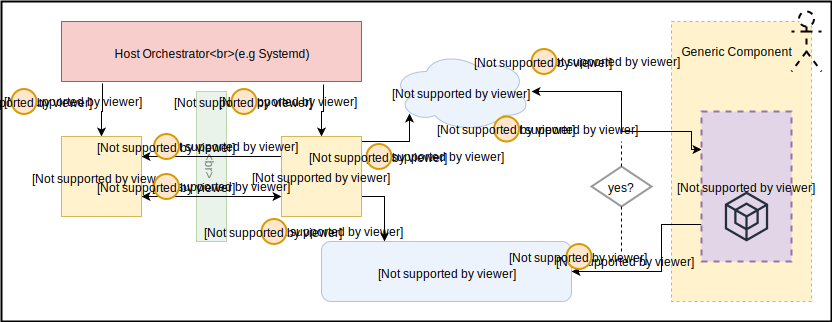

# GG-Lite `tes-http-serverd`: Design

> note: The “`tes-http-serverd`“ design is a living document, and will
> progressively change over time as we introduce new features or refactor old
> ones. The current state of the document should reflect the current
> implementation.

## Overview

The `tes-http-serverd` service daemon is a light-weight generic HTTP server for
Greengrass Nucleus Lite which main purpose is to host a credential provider
endpoint (on the provided or default server port) for other processes and the
AWS SDK to make an HTTP request to. If the incoming HTTP request is
authenticated and accepted, the TES HTTP server will provide a temporary session
token, access key, and the expiration as the response.

## System Flow



1. Host orchestrator starts up the `tesd` service
2. Host orchestrator starts up the `tes-http-serverd` service
3. `tes-http-serverd` establishes a core databus process connection to the
   `tesd` service
4. `tes-http-serverd` service gets the server up an running and listens on
   endpoint for any HTTP connections & requests
5. `tes-http-serverd` service exports the 2 main environment variables to the
   system, so that processes (e.g. AWS SDK Client) know TES server is able to be
   called
6. Some services, like AWS SDK Client, will check the env variables exist before
   attempting to make request to server
7. Services will make HTTP requests to the server on the server endpoint for
   temporary credentials.
8. On HTTP requests, `tes-http-serverd` service will use the databus connection
   to `tesd` to make a credential request API call.
9. Temporary credentials are acquired and sent as a response to the HTTP
   request.

## Server Configuration

For more information on the specification of the `tes-http-serverd`, see
[the spec document](https://github.com/aws-greengrass/aws-greengrass-lite/blob/gravel/spec/components/teshttpserverd.md).

#### Dependencies

`tesd` - The `tes-http-serverd` service has a HARD dependency on the TES daemon
(`tesd`). The host orchestrator will only start the `tes-http-serverd` if the
`tesd` service is in RUNNING/ACTIVE state.

#### Parameters

**`port`** (optional)- The `tes-http-serverd` service takes in an optional
parameter of a specified port number for the server to start on. If the port is
not provided, port will default to `8090`.

#### Endpoint

`/2016-11-01/credentialprovider` - The endpoint path in which HTTP GET requests
can be made to return the session credentials as a response. The
`tes-http-serverd` service will export the environment variable
`AWS_CONTAINER_CREDENTIALS_FULL_URI` of the full endpoint URI, e.g. defaulted to
[`http://localhost:8090/2016-11-01/credentialprovider`](http://localhost:8090/2016-11-01/credentialprovider/)
. The AWS SDK Client and other system processes with a valid authorization token
can make a request to this endpoint.

#### Authorization

Requests made to the `tes-http-serverd` service requires the authorization token
which is generated at startup of the Greengrass Nucleus Lite host orchestration.
The environment variable `AWS_CONTAINER_AUTHORIZATION_TOKEN` will be exported to
the system and enable the AWS SDK Client and other processes to connected to the
HTTP server successfully. Connections with an invalid authorization token will
be rejected.

## Request handling and Response generation

The `tes-http-serverd`’s core underlying functionality is created using the
aws-c-http library. For more information, see the
[repository](https://github.com/awslabs/aws-c-http). When properly configured
the server will be start up and will continuously listen on the port endpoint
for HTTP connections and requests to be made.

#### Connection Handling

The server is configured to handle incoming connections to the endpoint. On
incoming connections, the `tes-http-serverd` service will validate the
authorization token using the above authorization methodology. Once valid, will
establish an HTTP connection, and process to handle the request.

#### Request Handling

The server is configured to handle incoming requests. On incoming requests, the
`tes-http-serverd` service will validate the request headers. Once valid, the
server will process to response generation.

#### Response Generation

Once a server connection has been establish and the request has been validated,
the server will proceed to response generation.

`tes-http-serverd` will get a handle and establish a connection with the `tesd`
service. Once a connection has been made, `tes-http-serverd` will call `tesd`’s
core databus API `request_credentials` with the same authorization token which
was validated in the request. Returned from the API call will be the follow
response will temporary credentials:

```
{
    "AccessKeyId": "",
    "SecretAccessKey": "",
    "Token": "",
    "Expiration": ""
}
```

The same response will be returned as the response to the HTTP request being
made to the server. For more information on the credentials provided from the
`request_credentials` call, see the `tesd`: design document.
